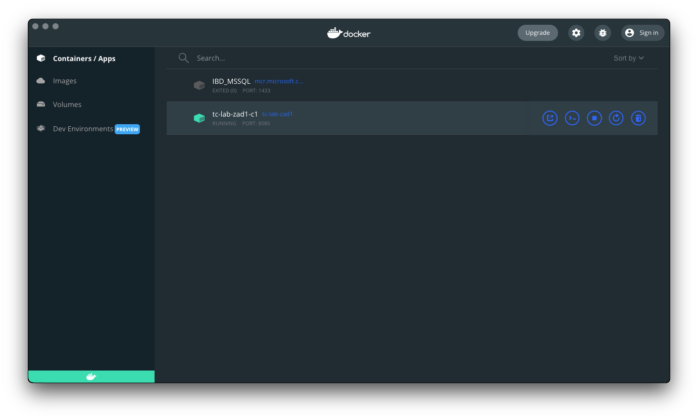
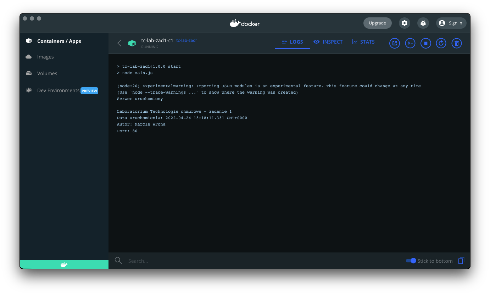
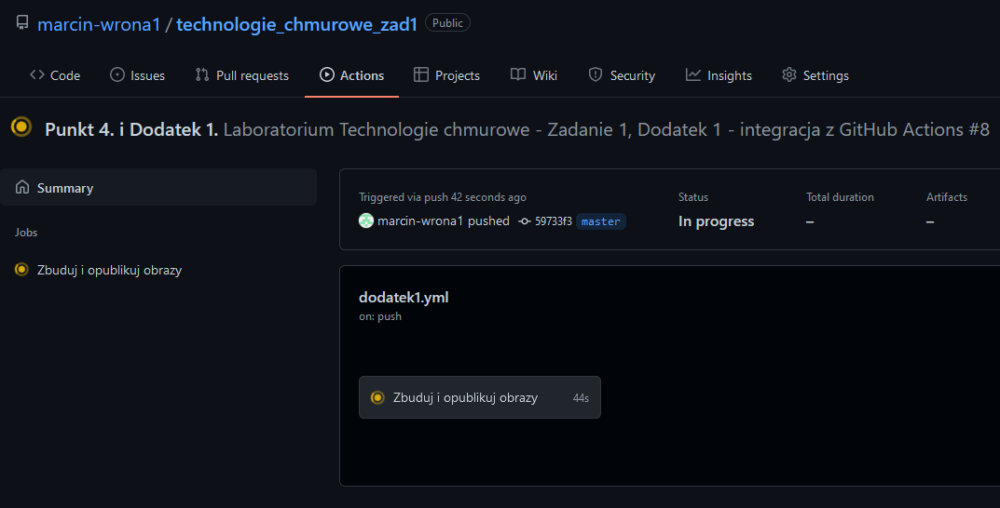

# Zadanie 1

## Punkt 3.
Zakładamy, że wszystkie polecenia zostaną wywołane w katalogu głównym repozytorium, np.
```sh
[/tmp]:$ git clone https://github.com/[...].git repo
Cloning into 'repo'...
remote: Enumerating objects: 107, done.
remote: Counting objects: 100% (21/21), done.
remote: Compressing objects: 100% (19/19), done.
remote: Total 107 (delta 10), reused 1 (delta 1), pack-reused 86
Receiving objects: 100% (107/107), 55.61 KiB | 6.18 MiB/s, done.
Resolving deltas: 100% (35/35), done.
[/tmp]:$ cd repo
[repo]:$ ls
Dockerfile
packege.json
zadanie1.md
[...]
```
a. Budujemy obraz, przydzielając mu nazwę tagu `tc-lab-zad1`:
```sh
[repo]:$ docker build -t tc-lab-zad1 .
```
b. Tworzymy kontener; od razu podajemy port do przekierowania, aby Docker go zapamiętał - dzięki temu nie musimy go podawać przy uruchamianiu. Przydzielamy nazwę kontenera `tc-lab-zad1-c1`. Podajemy nazwę taga z poprzedniego kroku (`tc-lab-zad1`):
```sh
[repo]:$ docker create -p 8080:80 --name tc-lab-zad1-c1 tc-lab-zad1
```
c. Używamy polecenia `docker logs` i nazwy (lub ID) kontenera - z poprzedniego kroku (`tc-lab-zad1-c1`)

```sh
[repo]:$ docker logs tc-lab-zad1-c1

> tc-lab-zad1@1.0.0 start
> node main.js

(node:20) ExperimentalWarning: Importing JSON modules is an experimental feature. This feature could change at any time
(Use `node --trace-warnings ...` to show where the warning was created)
Serwer uruchomiony

Laboratorium Technologie chmurowe - zadanie 1
Data uruchomienia: 2022-04-24 13:18:11.331 GMT+0000
Autor: Marcin Wrona
Port: 80
[repo]:$
```

Możemy również skorzystać z graficznego interfejsu, jeśli jest on dostępny w wersji oprogramowania Docker na używanym systemie operacyjnym. Np. na macOS:


Wybieramy kontener z listy i sprawdzamy zakładkę `LOGS`:


d. Korzystamy z polecenia `docker history`, podajemy nazwę tagu z kroku `a.` - `tc-lab-zad1`:
```sh
[repo]:$ docker history tc-lab-zad1
IMAGE          CREATED          CREATED BY                                      SIZE      COMMENT
eec15a0107b3   41 minutes ago   CMD ["start"]                                   0B        buildkit.dockerfile.v0
<missing>      41 minutes ago   ENTRYPOINT ["npm"]                              0B        buildkit.dockerfile.v0
<missing>      41 minutes ago   EXPOSE map[80/tcp:{}]                           0B        buildkit.dockerfile.v0
<missing>      41 minutes ago   ENV EXPRESS_PORT=80                             0B        buildkit.dockerfile.v0
<missing>      41 minutes ago   ENV AUTHOR=Marcin Wrona                         0B        buildkit.dockerfile.v0
<missing>      41 minutes ago   ENV NODE_ENV=production                         0B        buildkit.dockerfile.v0
<missing>      41 minutes ago   RUN /bin/sh -c npm install --production # bu…   206MB     buildkit.dockerfile.v0
<missing>      41 minutes ago   COPY . . # buildkit                             454kB     buildkit.dockerfile.v0
<missing>      51 minutes ago   WORKDIR /app                                    0B        buildkit.dockerfile.v0
<missing>      3 days ago       /bin/sh -c #(nop)  CMD ["node"]                 0B
<missing>      3 days ago       /bin/sh -c #(nop)  ENTRYPOINT ["docker-entry…   0B
<missing>      3 days ago       /bin/sh -c #(nop) COPY file:4d192565a7220e13…   388B
<missing>      3 days ago       /bin/sh -c set -ex   && for key in     6A010…   7.6MB
<missing>      3 days ago       /bin/sh -c #(nop)  ENV YARN_VERSION=1.22.18     0B
<missing>      3 days ago       /bin/sh -c ARCH= && dpkgArch="$(dpkg --print…   153MB
<missing>      3 days ago       /bin/sh -c #(nop)  ENV NODE_VERSION=18.0.0      0B
<missing>      4 days ago       /bin/sh -c groupadd --gid 1000 node   && use…   334kB
<missing>      4 days ago       /bin/sh -c set -ex;  apt-get update;  apt-ge…   529MB
<missing>      4 days ago       /bin/sh -c apt-get update && apt-get install…   152MB
<missing>      4 days ago       /bin/sh -c set -ex;  if ! command -v gpg > /…   19MB
<missing>      4 days ago       /bin/sh -c set -eux;  apt-get update;  apt-g…   10.7MB
<missing>      4 days ago       /bin/sh -c #(nop)  CMD ["bash"]                 0B
<missing>      4 days ago       /bin/sh -c #(nop) ADD file:3a81c181c66f226bd…   124MB
[repo]:$
```

## Punkt 4.
Zadanie wykonane za pomocą GitHub Actions (część dodatkowa zadania - Dodatek 1.).

Budowanie obrazów następuje po publikacji (`push`) repozytorium - czyli przy aktualizacji gałęzi `master`:
```sh
[repo]:$ grep -n2 -E 'on:$' .github/workflows/dodatek1.yml | tail -n3
3:on:
4-  push:
5-    branches: [master]
[repo]:$
```

Architektury wybieramy za pomocą parametru `platforms`:
```sh
[repo]:$ grep platforms .github/workflows/dodatek1.yml
          platforms: linux/arm/v7, linux/arm64/v8, linux/amd64
[repo]:$
```

Aby zbudować obrazy wystarczy opublikować gałąź repozytorium kodu źródłowego (`push`):
```sh
[repo]:$ git push --force github HEAD:master
Enumerating objects: 10, done.
Counting objects: 100% (10/10), done.
Delta compression using up to 4 threads
Compressing objects: 100% (5/5), done.
Writing objects: 100% (7/7), 2.40 KiB | 1.20 MiB/s, done.
Total 7 (delta 3), reused 0 (delta 0), pack-reused 0
remote: Resolving deltas: 100% (3/3), completed with 3 local objects.
To https://github.com/marcin-wrona1/technologie_chmurowe_zad1.git
 + b8944d0...59733f3 HEAD -> master (forced update)
[repo]:$
```

Wynik operacji `push` na GitHub Actions - hash commitu zgadza się z podanym przez `git` w terminalu - `59733f3`:



### Podpunkt 3 - GitHub Container Registry
W celu publikacji obrazu na platformie GitHub Container Registry zamiast Docker Hub, podajemy adres rejestru do kroku logowania oraz jako prefiks do nazwy tagu w kroku budowania. Aby nie duplikować adresu repozytorium oraz nazwy taga, zapisujemy je w zmiennych środowiskowych:
```sh
[repo]:$ grep -n3 -E 'env:$' .github/workflows/dodatek1.yml | tail -n4
7:env:
8-  # podpunkt 3 - wykorzystujemy rejestr GitHub Container Registry (GHCR)
9-  REGISTRY: ghcr.io
10-  IMAGE_NAME: technologie_chmurowe_lab:zad1
[repo]:$
```
Wykorzystujemy wartości tych zmiennych jako parametry do kroków budowania (logowanie do repozytorium oraz budowanie i publikacja):
```sh
[repo]:$ grep -n1 'env\.REGISTRY' .github/workflows/dodatek1.yml
29-        with:
30:          registry: ${{ env.REGISTRY }}
31-          # nazwa użytkownika - taka sama jak konto GitHub, na które jesteśmy zalogowani podczas push'a
--
43-          tags: |
44:            ${{ env.REGISTRY }}/${{ github.actor }}/${{ env.IMAGE_NAME }}
45-          # podpunkt 2 - cache; używamy GitHub Actions (GHA)
[repo]:$
```

### Podpunkt 2 - Cache
Aby wykorzysyać GitHub Actions do przechowywania cache, ustawiamy parametry `cache-from` i `cache-to` na `gha` - integrację Docker z GitHub Actions:
```sh
[repo]:$ grep -n1 gha .github/workflows/dodatek1.yml
45-          # podpunkt 2 - cache; używamy GitHub Actions (GHA)
46:          cache-from: type=gha
47:          cache-to: type=gha
[repo]:$
```

Aby potwierdzić działanie cache, sprawdzamy wykorzystanie cache przez nasze repozytorium - korzystamy z [zapytania API REST GitHub](https://docs.github.com/en/rest/actions/cache#get-github-actions-cache-usage-for-a-repository):
```sh
[repo]:$ OWNER='marcin-wrona1' REPO='technologie_chmurowe_zad1' sh -c 'curl "https://api.github.com/repos/${OWNER}/${REPO}/actions/cache/usage"'
{
  "full_name": "marcin-wrona1/technologie_chmurowe_zad1",
  "active_caches_size_in_bytes": 1417631505,
  "active_caches_count": 42
}
[repo]:$
```
