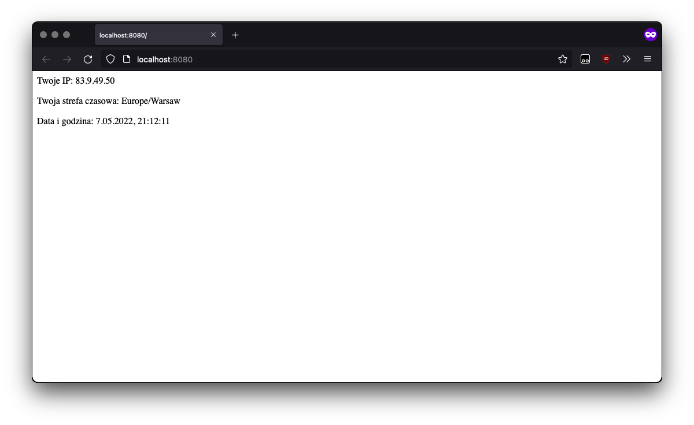
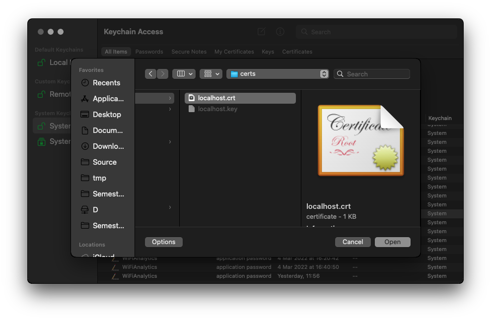
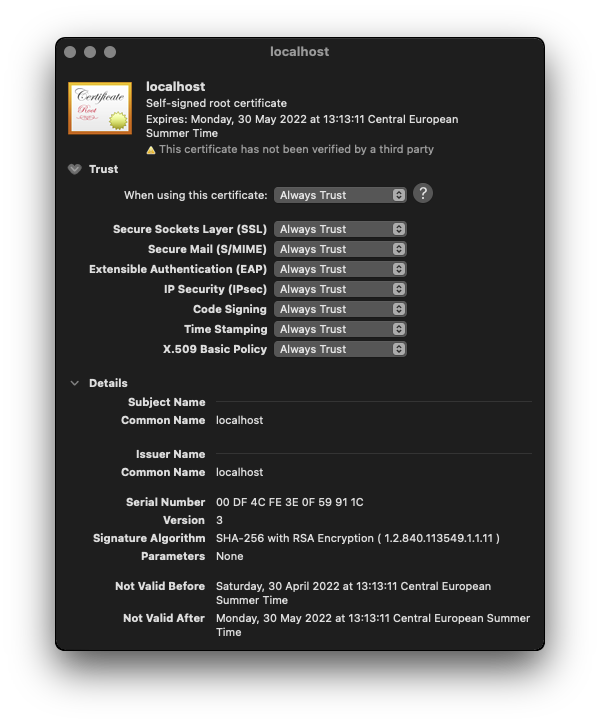

# Zadanie 1

## Punkt 1.

Demonstracja działania programu:



```sh
[repo]:% curl localhost:8080

			<p>Twoje IP: 83.9.49.50</p>
			<p>Twoja strefa czasowa: Europe/Warsaw</p>
			<p>Data i godzina: 7.05.2022, 21:15:45</p>

[repo]:%
```

## Punkt 2.

### Uwaga - sieci w Dockerze a adresy IP

Docker domyślnie używa programowej sieci mostkowanej, która działa jako proxy TCP. Używając proxy TCP tracimy informację o adresie IP, z którego dane zostały wysłane - wynika to z zasady działania takiego proxy. Zatem po uruchomieniu programu w kontenerze i przekierowaniu portów, każde zapytanie HTTP ma IP źródłowe ustawione na IP wirtualnego urządzenia w sieci zarządzanej przez oprogramowanie Docker.

Zatem w celu poprawnego działania aplikacji należy wykorzystać proxy typu HTTP, które zapisze IP źródłowe w nagłówku HTTP, z którego następnie zostanie ono odczytane przez serwer. W katalogu `/proxy` jest zawarta przykładowa konfiguracja dla serwera `nginx`, która przekierowuje ruch HTTPz portu `80` na port `8080`, dodając przy tym nagłówek `X-Forwarded-For`.

Jeżeli proxy HTTP nie zostanie wykorzystane, IP użytkownika zostanie utracone i zastąpione lokalnym IP. W przypadku wykrycia lokalnego IP, serwer sprawdzi swoje własne publiczne IP i wykorzysta go do uzyskania informacji o lokalizacji. Dzięki temu aplikacja zadziała również w przypadku prawdziwego połączenia z sieci lokalnej - np. z drugiego komputera.

## Punkt 3.

Zakładamy, że wszystkie polecenia zostaną wywołane w katalogu głównym repozytorium, np.

```sh
[/tmp]:$ git clone https://github.com/[...].git repo
Cloning into 'repo'...
remote: Enumerating objects: 107, done.
remote: Counting objects: 100% (21/21), done.
remote: Compressing objects: 100% (19/19), done.
remote: Total 107 (delta 10), reused 1 (delta 1), pack-reused 86
Receiving objects: 100% (107/107), 55.61 KiB | 6.18 MiB/s, done.
Resolving deltas: 100% (35/35), done.
[/tmp]:$ cd repo
[repo]:$ ls
Dockerfile
packege.json
zadanie1.md
[...]
```

a. Budujemy obraz, przydzielając mu nazwę tagu `tc-lab-zad1`:

```sh
[repo]:$ docker build -t tc-lab-zad1 .
```

b. Tworzymy kontener; od razu podajemy port do przekierowania, aby Docker go zapamiętał - dzięki temu nie musimy go podawać przy uruchamianiu. Przydzielamy nazwę kontenera `tc-lab-zad1-c1`. Podajemy nazwę taga z poprzedniego kroku (`tc-lab-zad1`):

```sh
[repo]:$ docker create -p 8080:80 --name tc-lab-zad1-c1 tc-lab-zad1
```

c. Używamy polecenia `docker logs` i nazwy (lub ID) kontenera - z poprzedniego kroku (`tc-lab-zad1-c1`)

```sh
[repo]:$ docker logs tc-lab-zad1-c1

> tc-lab-zad1@1.0.0 start
> node main.js

(node:20) ExperimentalWarning: Importing JSON modules is an experimental feature. This feature could change at any time
(Use `node --trace-warnings ...` to show where the warning was created)
Serwer uruchomiony

Laboratorium Technologie chmurowe - zadanie 1
Data uruchomienia: 2022-04-24 13:18:11.331 GMT+0000
Autor: Marcin Wrona
Port: 80
[repo]:$
```

Możemy również skorzystać z graficznego interfejsu, jeśli jest on dostępny w wersji oprogramowania Docker na używanym systemie operacyjnym. Np. na macOS:


Wybieramy kontener z listy i sprawdzamy zakładkę `LOGS`:


d. Korzystamy z polecenia `docker history`, podajemy nazwę tagu z kroku `a.` - `tc-lab-zad1`:

```sh
[repo]:$ docker history tc-lab-zad1
IMAGE          CREATED          CREATED BY                                      SIZE      COMMENT
eec15a0107b3   41 minutes ago   CMD ["start"]                                   0B        buildkit.dockerfile.v0
<missing>      41 minutes ago   ENTRYPOINT ["npm"]                              0B        buildkit.dockerfile.v0
<missing>      41 minutes ago   EXPOSE map[80/tcp:{}]                           0B        buildkit.dockerfile.v0
<missing>      41 minutes ago   ENV EXPRESS_PORT=80                             0B        buildkit.dockerfile.v0
<missing>      41 minutes ago   ENV AUTHOR=Marcin Wrona                         0B        buildkit.dockerfile.v0
<missing>      41 minutes ago   ENV NODE_ENV=production                         0B        buildkit.dockerfile.v0
<missing>      41 minutes ago   RUN /bin/sh -c npm install --production # bu…   206MB     buildkit.dockerfile.v0
<missing>      41 minutes ago   COPY . . # buildkit                             454kB     buildkit.dockerfile.v0
<missing>      51 minutes ago   WORKDIR /app                                    0B        buildkit.dockerfile.v0
<missing>      3 days ago       /bin/sh -c #(nop)  CMD ["node"]                 0B
<missing>      3 days ago       /bin/sh -c #(nop)  ENTRYPOINT ["docker-entry…   0B
<missing>      3 days ago       /bin/sh -c #(nop) COPY file:4d192565a7220e13…   388B
<missing>      3 days ago       /bin/sh -c set -ex   && for key in     6A010…   7.6MB
<missing>      3 days ago       /bin/sh -c #(nop)  ENV YARN_VERSION=1.22.18     0B
<missing>      3 days ago       /bin/sh -c ARCH= && dpkgArch="$(dpkg --print…   153MB
<missing>      3 days ago       /bin/sh -c #(nop)  ENV NODE_VERSION=18.0.0      0B
<missing>      4 days ago       /bin/sh -c groupadd --gid 1000 node   && use…   334kB
<missing>      4 days ago       /bin/sh -c set -ex;  apt-get update;  apt-ge…   529MB
<missing>      4 days ago       /bin/sh -c apt-get update && apt-get install…   152MB
<missing>      4 days ago       /bin/sh -c set -ex;  if ! command -v gpg > /…   19MB
<missing>      4 days ago       /bin/sh -c set -eux;  apt-get update;  apt-g…   10.7MB
<missing>      4 days ago       /bin/sh -c #(nop)  CMD ["bash"]                 0B
<missing>      4 days ago       /bin/sh -c #(nop) ADD file:3a81c181c66f226bd…   124MB
[repo]:$
```

## Punkt 4.

Zadanie wykonane za pomocą GitHub Actions (część dodatkowa zadania - Dodatek 1.).

Budowanie obrazów następuje po publikacji (`push`) repozytorium - czyli przy aktualizacji gałęzi `master`:

```sh
[repo]:$ grep -n2 -E 'on:$' .github/workflows/dodatek1.yml | tail -n3
3:on:
4-  push:
5-    branches: [master]
[repo]:$
```

Architektury wybieramy za pomocą parametru `platforms`:

```sh
[repo]:$ grep platforms .github/workflows/dodatek1.yml
          platforms: linux/arm/v7, linux/arm64/v8, linux/amd64
[repo]:$
```

Aby zbudować obrazy wystarczy opublikować gałąź repozytorium kodu źródłowego (`push`):

```sh
[repo]:$ git push --force github HEAD:master
Enumerating objects: 10, done.
Counting objects: 100% (10/10), done.
Delta compression using up to 4 threads
Compressing objects: 100% (5/5), done.
Writing objects: 100% (7/7), 2.40 KiB | 1.20 MiB/s, done.
Total 7 (delta 3), reused 0 (delta 0), pack-reused 0
remote: Resolving deltas: 100% (3/3), completed with 3 local objects.
To https://github.com/marcin-wrona1/technologie_chmurowe_zad1.git
 + b8944d0...59733f3 HEAD -> master (forced update)
[repo]:$
```

Wynik operacji `push` na GitHub Actions - hash commitu zgadza się z podanym przez `git` w terminalu - `59733f3`:


### Podpunkt 3 - GitHub Container Registry

W celu publikacji obrazu na platformie GitHub Container Registry zamiast Docker Hub, podajemy adres rejestru do kroku logowania oraz jako prefiks do nazwy tagu w kroku budowania. Aby nie duplikować adresu repozytorium oraz nazwy taga, zapisujemy je w zmiennych środowiskowych:

```sh
[repo]:$ grep -n3 -E 'env:$' .github/workflows/dodatek1.yml | tail -n4
7:env:
8-  # podpunkt 3 - wykorzystujemy rejestr GitHub Container Registry (GHCR)
9-  REGISTRY: ghcr.io
10-  IMAGE_NAME: technologie_chmurowe_lab:zad1
[repo]:$
```

Wykorzystujemy wartości tych zmiennych jako parametry do kroków budowania (logowanie do repozytorium oraz budowanie i publikacja). Do parametru `tags` podajemy dwa tagi - jeden na DockerHub i jeden na GitHub Container Registry:

```sh
[repo]:$ grep -n1 'env\.REGISTRY' .github/workflows/dodatek1.yml
35-        with:
36:          registry: ${{ env.REGISTRY }}
37-          # nazwa użytkownika - taka sama jak konto GitHub, na które jesteśmy zalogowani podczas push'a
--
49-          tags: |
50:            ${{ secrets.DOCKER_HUB_USERNAME }}/${{ env.IMAGE_NAME }},${{ env.REGISTRY }}/${{ github.actor }}/${{ env.IMAGE_NAME }}
51-          # podpunkt 2 - cache; używamy GitHub Actions (GHA)
[repo]:$
```

### Podpunkt 2 - Cache

Aby wykorzysyać GitHub Actions do przechowywania cache, ustawiamy parametry `cache-from` i `cache-to` na `gha` - integrację Docker z GitHub Actions:

```sh
[repo]:$ grep -n1 gha .github/workflows/dodatek1.yml
45-          # podpunkt 2 - cache; używamy GitHub Actions (GHA)
46:          cache-from: type=gha
47:          cache-to: type=gha
[repo]:$
```

Aby potwierdzić działanie cache, sprawdzamy wykorzystanie cache przez nasze repozytorium - korzystamy z [zapytania API REST GitHub](https://docs.github.com/en/rest/actions/cache#get-github-actions-cache-usage-for-a-repository):

```sh
[repo]:$ OWNER='marcin-wrona1' REPO='technologie_chmurowe_zad1' sh -c 'curl "https://api.github.com/repos/${OWNER}/${REPO}/actions/cache/usage"'
{
  "full_name": "marcin-wrona1/technologie_chmurowe_zad1",
  "active_caches_size_in_bytes": 1417631505,
  "active_caches_count": 42
}
[repo]:$
```

## Dodatek 2

### Punkt 1. - podpunkt a.

Pobieramy obraz rejestru:

```sh
[repo]:$ docker pull registry:2
2: Pulling from library/registry
Digest: sha256:dc3cdf6d35677b54288fe9f04c34f59e85463ea7510c2a9703195b63187a7487
Status: Image is up to date for registry:2
docker.io/library/registry:2
[repo]:$
```

Tworzymy kontener. Serwer nasłuchuje na porcie `5000` wewnątrz kontenera, więc właśnie na ten port przekierujemy komunikację z portu `6677`. Użwyamy parametru `-p`:

```sh
[repo]:$ docker container create -p 6677:5000 --name=tc-zad1-dodatek2 registry:2
3be2845c2f1b0b668e4575b2f49cb84e04b15ab28ef03a2de840171f39b5836f
[repo]:$ docker container ls -a | grep tc-zad1-dodatek2
3be2845c2f1b   registry:2                              "/entrypoint.sh /etc…"   8 seconds ago   Created                                            tc-zad1-dodatek2
[repo]:$
```

Uruchamiamy kontener, sprawdzamy działanie rejestru (wyświetlamy dostępne obrazy za pomocą API REST):

```sh
[repo]:$ docker start tc-zad1-dodatek2
tc-zad1-dodatek2
[repo]:$ curl localhost:6677/v2/_catalog
{"repositories":[]}
[repo]:$
```

Dostajemy odpowiedź: lista repozytoriów jest pusta. Serwer rejestru działa i mamy do niego dostęp.

### Punkt 1. - podpunkt b.

Pobieramy obraz ubuntu:

```sh
[repo]:$ docker pull ubuntu:latest
latest: Pulling from library/ubuntu
125a6e411906: Pull complete
Digest: sha256:26c68657ccce2cb0a31b330cb0be2b5e108d467f641c62e13ab40cbec258c68d
Status: Downloaded newer image for ubuntu:latest
docker.io/library/ubuntu:latest
[repo]:$
```

Zmieniamy nazwę, zapisujemy w rejestrze:

```sh
[repo]:$ docker tag ubuntu:latest localhost:6677/wcale-nie-ubuntu
[repo]:$ docker push localhost:6677/wcale-nie-ubuntu
Using default tag: latest
The push refers to repository [localhost:6677/wcale-nie-ubuntu]
e59fc9495612: Pushed
latest: digest: sha256:aa6c2c047467afc828e77e306041b7fa4a65734fe3449a54aa9c280822b0d87d size: 529
[repo]:$ curl localhost:6677/v2/_catalog
{"repositories":["wcale-nie-ubuntu"]}
[repo]:$
```

### Punkt 2.

Według dokumentacji oprogramowania Docker, aby mechanizm `basic auth` zadziałał niezbędne jest włączenie TLS. Zatem musimy skorzystać z protokołu HTTPS i potrzebujemy certyfikatu. Ponieważ na potrzeby zadania nie jest wymagane, aby opublikować nasz rejestr w Internecie, zamiast generować certyfikat dla domeny (np. uzyskanej za pomocą usługi typu `dynamic DNS`), wygenerujemy własny certyfikat i dodamy go do magazynu certyfikatów systemu operacyjnego.

Generujemy certyfikat (wg. dokumentacji [Let's encrypt](https://letsencrypt.org/docs/certificates-for-localhost/)):

```sh
[repo]:$ mkdir certs
[repo]:$ (cd certs && openssl req -x509 -out localhost.crt -keyout localhost.key \
  -newkey rsa:2048 -nodes -sha256 \
  -subj '/CN=localhost' -extensions EXT -config <( \
   printf "[dn]\nCN=localhost\n[req]\ndistinguished_name = dn\n[EXT]\nsubjectAltName=DNS:localhost\nkeyUsage=digitalSignature\nextendedKeyUsage=serverAuth"))
Generating a 2048 bit RSA private key
..+++
......+++
writing new private key to 'localhost.key'
-----
[repo]:$ ls certs
localhost.crt localhost.key
[repo]:$
```

Dodajemy certyfikat do magazynu systemowego (pęk kluczy `System` dla systemu macOS):



W szczegółach certyfikatu ustawiamy opcje zaufania - chcemy, aby system zawsze ufał temu certyfikatowi:



Następnie generujemy hash hasła dla użytkownika `student`:

```sh
[repo]:$ mkdir auth
[repo]:$ htpasswd -Bbn student student > auth/htpasswd
[repo]:$ cat auth/htpasswd
student:$2y$05$vac5yd39T.gt2cyjioV5yO5DY.N6x28eIzU.FOfAu3eZhnWJA5unG

[repo]:$
```

Ponownie tworzymy kontener ze zmienioną konfiguracją - dodajemy nasz certyfikat oraz plik `htpasswd`, za pomocą mechanizmu `bind-mount`:

```sh
[repo]:$ docker stop tc-zad1-dodatek2
tc-zad1-dodatek2
[repo]:$ docker container rm tc-zad1-dodatek2
tc-zad1-dodatek2
[repo]:$ docker container create -p 6677:5000 -v "$(pwd)"/auth:/auth -e "REGISTRY_AUTH=htpasswd" -e "REGISTRY_AUTH_HTPASSWD_REALM=Registry Realm" -e REGISTRY_AUTH_HTPASSWD_PATH=/auth/htpasswd -v "$(pwd)"/certs:/certs -e REGISTRY_HTTP_TLS_CERTIFICATE=/certs/localhost.crt -e REGISTRY_HTTP_TLS_KEY=/certs/localhost.key --name=tc-zad1-dodatek2 registry:2
c2cfa7c3289e5a3630b6d5ba6b4c27bcc4ff6df68d813db0b3e1d893a7528611
[repo]:$ docker start tc-zad1-dodatek2
tc-zad1-dodatek2
[repo]:$
```

Sprawdzamy działanie `basic auth`:

```sh
[repo]:$ curl localhost:6677/v2/_catalog
Client sent an HTTP request to an HTTPS server.
[repo]:$ curl https://localhost:6677/v2/_catalog
{"errors":[{"code":"UNAUTHORIZED","message":"authentication required","detail":[{"Type":"registry","Class":"","Name":"catalog","Action":"*"}]}]}
[repo]:$ curl -u student:student https://localhost:6677/v2/_catalog
{"repositories":[]}
[repo]:$ docker push localhost:6677/wcale-nie-ubuntu
Using default tag: latest
The push refers to repository [localhost:6677/wcale-nie-ubuntu]
e59fc9495612: Preparing
no basic auth credentials
[repo]:$ docker login localhost:6677 2> /dev/null
Username: student
Password:
Login Succeeded
[repo]:$ docker push localhost:6677/wcale-nie-ubuntu
Using default tag: latest
The push refers to repository [localhost:6677/wcale-nie-ubuntu]
e59fc9495612: Pushed
latest: digest: sha256:aa6c2c047467afc828e77e306041b7fa4a65734fe3449a54aa9c280822b0d87d size: 529
[repo]:$ curl -u student:student https://localhost:6677/v2/_catalog
{"repositories":["wcale-nie-ubuntu"]}
[repo]:$
```
